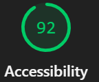

# Accessibilité - Référentiel RGAA

## Référentiel choisi : RGAA 4.1 + WCAG 2.1 AA

## Score Lighthouse > 90 (92)

## Actions mises en œuvre
- **Navigation clavier** : Tous les éléments accessibles au Tab
- **Lecteurs d'écran** : Attributs aria-label, alt sur images
- **Contrastes** : Ratio 4.5:1 minimum
- **Tailles de police** : Zoomable
- **Structure sémantique** : Balises HTML5 appropriées
- **Erreurs explicites** : Messages d'erreur clairs

## Tests réalisés
- Validation avec axe-core
- Tests manuels navigation clavier
- Tests avec lighthouse